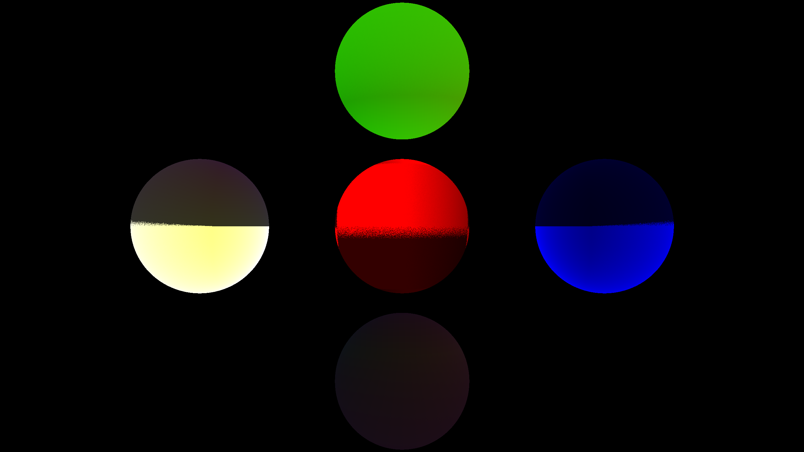

# cpu-raytracer
A simple raytracer with a little bit of help from [raytracing in a weekend](https://raytracing.github.io/books/RayTracingInOneWeekend.html) and my own implementation of things.

The yellow spot on the red sphere is diffused reflection of the green one.
